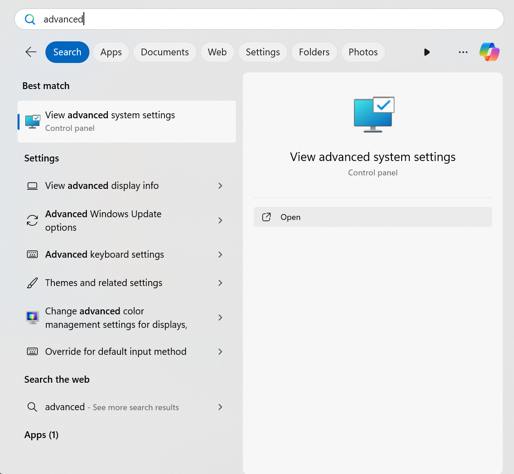
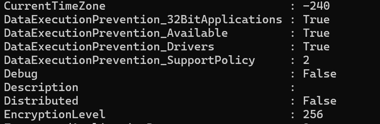
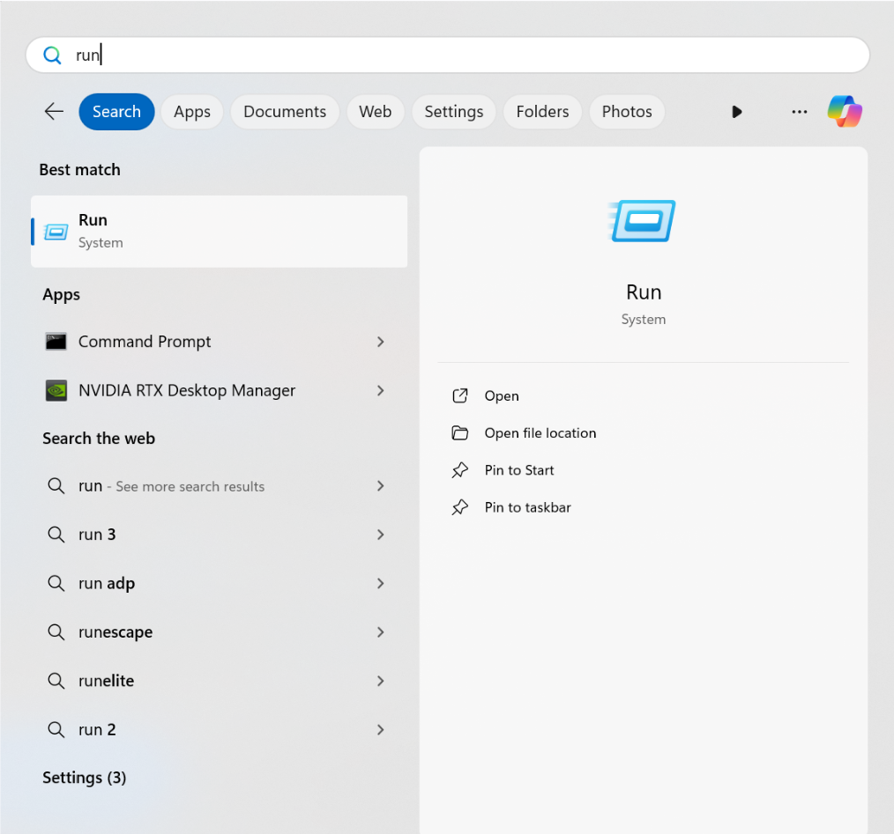

# Data Execution Protection
*Notice*: Originally based off notes from [llan-OuO](https://github.com/llan-OuO).
---
> Prevents code from being run from data-only memory pages. - Microsoft

Data execution protection (DEP) for Windows is a system-level defense mechanism that can be enabled to help protect against certain types of attacks, such as those that inject shellcode onto the stack through something like a buffer overflow and later execute the shellcode. Within Windows systems, there are two implementations of DEP: Software-based DEP and Hardware-based DEP. We can enable hardware-based DEP as long as both the CPU and OS support this feature.

DEP provides this protection by including additional checks at runtime. In the case of [Hardware Based DEP](#hardware-based-dep), these protections are implemented and, therefore, must be supported at the Hardware Level; this support is provided by the CPU and its Memory Management Unit (MMU). [Software Based DEP](#software-based-dep) is also a runtime protection; however, it is very limited in its nature. 

Both 64-bit and 32-bit executables have DEP enabled by default. DEP for 64-bit executables cannot be disabled, while DEP for 32-bit executables can be disabled on a per-process basis [1]. Additionally, the `/NXCOMPAT` flag, which is used to set if DEP is utilized or not for a given executable, is enabled by default in the Visual Studio Linker when using the GUI. At the system level, DEP is " configured at boot according to the no-execute page protection policy setting in the boot configuration data.", and we can at runtime use the [`SetProcessDEPPolicy(...)`](https://learn.microsoft.com/en-us/windows/win32/api/winbase/nf-winbase-setprocessdeppolicy) function in 32-bit programs to control this on a per-process basis [4], we discuss this configuration further in the [Enabling DEP](#enabling-dep) section. 


> DEP prevents memory that was not explicitly allocated as executable from being executed. [1]
## Hardware Based DEP
When the CPU's MMU loads a memory page, the *protection bits* in the page table entry are examined to determine if the instructions we wish to execute are from a valid location in memory. One of these bits is commonly referred to as the No eXecute (NX) bit, which controls whether the memory page's contents can be loaded into the CPU and executed. This NX bit enables the use of Hardware-based DEP and the behaviors discussed later.

> [!NOTE]
> The exact terminology used to refer to the bit that controls if a memory page can have its contents loaded and executed by the CPU differs between CPU architectures and manufacturers. For example, AMD refers to this as No-eXecute memory page protection (NX) feature and Intel refers to this as the Execute Disable bit (XD).
>
> For simplicity, we will use the common No eXecute (NX) bit terminology introduced earlier.

When the program is loaded into memory and Hardware-enforced DEP is enabled, the system marks all memory pages of a process as non-executable except for those that store the sections containing executable code. This is determined by the *Section Headers* of the PE file, which are set at compile time, if the section contains the `IMAGE_SCN_MEM_EXECUTE` characteristic then it's contents should be executable and the memory page it is loaded into should not have the NX bit set; the only section that has this set in a PE file is the `.text` section containing the executable code [7]. This means all the other memory pages that contain the other sections should have the NX bit set, as they do not contain executable code! 

This means when DEP is enabled, our program can not load and execute instructions from a process's default stack or heap unless we make some changes to the memory pages they are located in. If an application has to run code from other memory pages, it must either allocate memory pages with a function like [`VirtualAlloc(...)`](https://learn.microsoft.com/en-us/windows/win32/api/memoryapi/nf-memoryapi-virtualalloc) and set the proper virtual memory protection attributes, namely one of PAGE_EXECUTE, PAGE_EXECUTE_READ, PAGE_EXECUTE_READWRITE, or PAGE_EXECUTE_WRITECOPY [4]. Additionally, as we have done in the [VChat ROP](https://github.com/DaintyJet/VChat_TRUN_ROP) and [VChat CFG](https://github.com/DaintyJet/VChat_CFG) exploits, we can use the `VirtualProtect(...)`(https://learn.microsoft.com/en-us/windows/win32/api/memoryapi/nf-memoryapi-virtualprotect) function to change the protections on a region of memory that has already been loaded such as the process's stack.

> [!NOTE]
> Allocations made with [`malloc(...)`](https://learn.microsoft.com/en-us/cpp/c-runtime-library/reference/malloc?view=msvc-170) or [HeapAlloc(...)](https://learn.microsoft.com/en-us/windows/win32/api/heapapi/nf-heapapi-heapalloc) are non-executable and do not contain the necessary arguments or flags to change the protections when allocating memory. It should be noted that you can still use `VirtualProtect` on regions of memory these allocations occur in.

If we were to try and set the Instruction Pointer (EIP, RIP, etc) to a location in memory which is within a section not marked as executable, and therefore has the NX-bit of the memory page set, then the processor will raise an exception with the code `STATUS_ACCESS_VIOLATION` when we attempt to load and execute the instruction [2][4].

> [!NOTE]
> Most modern CPUs will have some kind of support for the NX-bit used to enable DEP protections, though you may find modern low-power and low-cost chips used in embedded systems may not contain this addition.
>
> It should be noted that old X86 processes without Physical Address Extension (PAE) addresses do not support DEP on Windows [2]. It should also be noted that the original PE file format contained the characteristic flag `IMAGE_SCN_CNT_CODE` to specify a section as executable [9]. This means as long as the compiler and linker used to create an executable properly marked the `.text` section as executable, then DEP can be used on old Windows executables even though they were created at a time when the Hardware did not support this kind of protection. 


## Software Based DEP
Software-based DEP is, at least on Windows XP systems, enabled on core operating system components and services [2][5]. However, it should be noted that Software-Based DEP only supports "limited system binaries regardless of the hardware-enforced DEP capabilities of the processor" [2][5]. This is because it is designed to protect the Exception Handling mechanisms in a Windows process; when this was introduced, this meant protecting SEH chains. 

If the executable was compiled with SafeSEH, software-based DEP ensures that the handler in the SEH chain contains a pointer to a valid location in memory that is part of the registered function table. If SafeSEH is not enabled, software-based DEP ensures that the pointer contains a location in memory that is marked as executable.

> [!NOTE]
> There are implementations for the Linux Kernel to emulate NX-bit hardware support on more than just exception handling as is done in Windows. One such example is the [PaX](https://en.wikipedia.org/wiki/Executable-space_protection#PaX:~:text=May%202%2C%202003-,PaX,-%5Bedit%5D) system. As we are focusing on Windows, this will not have any further discussion but is brought up to show that we can emulate NX-Protections on legacy hardware. 


## Exceptions and Considerations
There are a few possible exceptions to the application of DEP on a process. The first is for those processes that use Just In Time (JIT) Compilers, as these may compile and write code into the memory of the process space and then attempt to execute it, if the region the JIT compiler writes to is not properly managed and the protections of the page with are not set to allow execution (With `VirtualProtect(...)`), then there will be issues when running the program as exceptions will be raised when that code is attempted to be executed [2] [4]. An additional thing to note is that some binaries may place chunks of executable code in a data section, these are referred to as *thunks* which are generally small pieces of code that take some small action and then jump to an intended target [4]. Generally, these programs should 

If you do make a region of memory executable when allocating it with `VirtualAlloc(...)`, or if you mark an existing region of memory as executable using `VirtualProtect(...)`, then you should be sure to remove write permissions when possible. This is because, if we make a writable and executable region of memory that can be accesses by an attacker, as we have seen throughout the VChat functions it can be quite dangerous as it can allow and enable arbitrary code execution.

## Enabling DEP 
This section will cover the process used to enable DEP on a system-wide level and on a per-process basis. 

### DEP Policies
We can modify the DEP policy applied to the system with the [`bcdedit`](https://learn.microsoft.com/en-us/windows-server/administration/windows-commands/bcdedit) command line tool, there are four options encoded with the values [0, 3]. This **Does Not** need to be done for this exercise, but is included for completeness.

> [!IMPORTANT]
> `bcdedit` modifies your Boot configuration files, so you need to be careful and if you do this on a machine that has Bitlocker enabled you must ensure you have access to the Bitlocker key otherwise you may lose access to the system.

The following list describes the possible policies we can apply to the system:
* `AlwaysOff`: Value of **0**, DEP is not enabled for *any* process.
* `AlwaysOn`: Value of **1**, DEP is enabled for all processes.
* `OptIn`: Value of **2**, DEP is enabled for Windows Services; processes with `NXCOMPAT` set will have DEP enabled.
* `OptOut`: Value of **3**, DEP is enabled for all processes; administrators can manually create a list of applications that will not have DEP applied.


If you would like you can modify the DEP policy of a Windows machine using the following command, you can replace *AlwaysOn* with one of the other previously discussed options.
```
$ bcdedit /set nx AlwaysOn
```
* `bcdedit`: CLI tool to configure Boot Configuration File
* `/set nx`: Set NX (DEP) boot configuration
* `AlwaysOn` Set to always on (Forces all processes to have DEP), this can be replaced.

> [!IMPORTANT]
> Forcing all processes to use DEP may break certain processes, so you need to be careful. Additional details are discussed in [Exceptions and Considerations](#exceptions-and-considerations).

### System
Before modifying your system settings, make sure you have all of the required keys, such as a *BitLocker key*, in order to successfully boot into the system once you make these changes!

#### Settings menu
1. Open Windows Security Settings

    

2. Open App & Browser Control, Navigate to Exploit Protection Settings

    

3. From here, we can enable or disable DEP on a system-wide basis. The default setting is *On*, and if we wish to make a change, as can be seen in the screenshot, we will need to restart the system.

    


#### Advanced System Settings
1. Open *Advanced System Settings* by using the search bar (or any alternative method.):

    

2. In *Advanced* select *Performance*.

    

3. Select *Data Execution Protection*.

    

4. We can select DEP for only Windows Programs and Services, or we can enable DEP for all processes. Individual exceptions can be provided.


### Processes Level

In order for DEP to be properly utilized the program being executed should be Linked with the [`/NXCOMPAT`](https://learn.microsoft.com/en-us/cpp/build/reference/nxcompat-compatible-with-data-execution-prevention?view=msvc-170) flag, if you have specified that DEP is always on in the system's boot configuration then this flag has no effect, the same is true if you have configured the system with DEP set to always off. We will show the basics for enabling DEP with the `/NXCOMPAT` flag in Visual Studio.

1. Open a Visual Studio Project, in this case I opened VChat.
2. Open the Project Properties settings.

    

3. Open `Linker` -> `Advanced`.

    

4. Select DEP and ensure it is Enabled (It will be by default).

    


We can also programmatically set the DEP protections on a 32-bit process with the `SetProcessDEPPolicy(...)` function. If you attempt to use this function within a 64-bit process the function will fail with an error `ERROR_NOT_SUPPORTED` [9]. Additionally this function will only succeeded on systems where the DEP policy was set to *OptIn* or *OptOut*, if it has been set to *AlwaysOn* or *AlwaysOff* the call will first return with an error and all subsequent calls will be ignored [9].  

The function has the following signature and will return `TRUE` if it succeeds and `FALSE` if it fails:
```
BOOL SetProcessDEPPolicy(
  [in] DWORD dwFlags
);
```
* `dwFlags`: Consists of a flag to control the DEP policy of the process.
  * `PROCESS_DEP_DISABLE_ATL_THUNK_EMULATION`: Disable ATL Thunk Emulation.
  * `PROCESS_DEP_ENABLE`: enable DEP on the process.
  * `0`: Disable DEP on the process.
## Examining DEP Compatible Systems and Processes
This section will cover various ways to determine if your system supports DEP and examine which processes are utilizing the DEP protections your system provides. 


### System Support WMIC
We can use the command-line tool [`wmic`](https://learn.microsoft.com/en-us/windows/win32/wmisdk/wmic) in a `cmd` or `powershell` window to control the Windows Management Instrumentation (WMI) from the command line. This tool is referenced in [3] as a method to determine if your system supports DEP and if it is enabled. However, it should be noted that `wmic` has been deprecated, so we also provide a method using the *WMI* **cmdlets** that superseded it, namely `Get-WmiObject`.  

1. Open a powershell window.

    

2. Run the following command to determine if Hardware Enforced DEP is supported on your machine.
    ```
    $ wmic OS Get DataExecutionPrevention_Available
    ```
    * `wmic`: WMI command interface.
      * `OS`: Class Alias for managing "Installed Operating System/s management".
      * `Get`: Retrieves specific property values.
      * `DataExecutionPrevention_Available`: Property value for DEP Hardware Support.
    * If the result is **TRUE** then it is supported, otherwise it is not supported.

        

3. Run the following command to determine the DEP policy that is currently being applied, this can have one of 4 values in the range [0,3]. The details of their meaning can be found in the [DEP Polices](#dep-policies) section.
    ```
    $ wmic OS Get DataExecutionPrevention_SupportPolicy
    ```
    * `wmic`: WMI command interface.
      * `OS`: Class Alias for managing "Installed Operating System/s management".
      * `Get`: Retrieves specific property values.
      * `DataExecutionPrevention_SupportPolicy`: Property value for DEP policy applied.
    * We can see this system has the policy type 2 applied, this means the policy is *OptIn*.

        

4. We can use the following cmdlet to get the same information.
    ```ps
    $ Get-WmiObject -Class Win32_OperatingSystem | Format-List -Property *
    ```
    * `Get-WmiObject`: Get instances or information about/from the WMI classes.
    * `-Class Win32_OperatingSystem`: Retrieve instance of *Win32_OperatingSystem* class.
    * `Format-List`: Format properties as a list. We pipe the output of *Get-WmiObject* into this.
    * `-Property *`: All Properties.

5. You can scroll up to view the DEP-related properties.

    

> [!NOTE]
> You can modify the command to only output the properties you would like, for example, to mirror the `wmic` instructions we can do the following:
> `Get-WmiObject -Class Win32_OperatingSystem | Format-List -Property DataExecutionPrevention_Available`
>
> `Get-WmiObject -Class Win32_OperatingSystem | Format-List -Property DataExecutionPrevention_SupportPolicy`
### System Support WBEMTEST
The [`wbmtest`](https://learn.microsoft.com/en-us/mem/configmgr/develop/core/understand/introduction-to-wbemtest) tool is a simple GUI viewer and editor for the WMI configurations, and information. This program is available on most systems, it is simpler compared to other tools but for our purposes it provides enough functionality.

1. Open the *Run* window.

    

2. Enter `wbemtest`, and click *Ok*

    

3. Click *connect*, and enter in `root\cimv2` and then click connect again. The entry `root\cimv2` specifies we are using the default namespace where the majority of the WMI classes are stored.

    

4. Click *Enum Instance*, enter in `Win32_OperatingSystem` and click *Ok*.

    

5. Double-click the first entry.

    

6. Scroll down till you find the DEP Properties.

    

7. Double-click on a DEP entry to view its value; you can repeat this for the Policy.

    

   * Click Cancel to exit it without changing anything.

### Examine Processes Running DEP with Task Manager
Now we will use Task-Manager's detailed view to examine which programs and services have DEP enabled on the system. As Task Manager is installed on all Windows systems this provides an easy and simple method to see which processes have DEP enabled.

1. Open VChat with DEP disabled.

    

2. Open Task Manager.

    

3. Navigate to *Details*.

    

4. Right-click an empty space and select *Select Columns*.

    

5. Toggle on the DEP Column.

    

6. We can sort by DEP and look at which services have it enabled and those that have it disabled.

    

### Examine Processes Running DEP with Process Explorer
Now we will use [Process Explorer](https://learn.microsoft.com/en-us/sysinternals/downloads/process-explorer) to view which processes on the system have DEP enabled. Process Explorer is part of Windows's Sysinternals suite of tools. This can be likened to a much more powerful version of Task Manager, providing a great deal of information on individual processes and their children.

1. Open VChat with DEP disabled.

    

2. Open Process Explorer.

    

3. Right-click an unoccupied space and click *Select Columns*.

    

4. Enable the Column for *DEP*.

    

5. Again we can sort by DEP and view those processes that have it Disabled or Enabled. 

    

### Examine Individual Processes with DumpBin and Mona.py
This section will discuss the use of [`dumpbin`](https://learn.microsoft.com/en-us/cpp/build/reference/dumpbin-command-line?view=msvc-170), a CLI tool included in the Visual Studio VC++ suite of tools that can be used to display information contained within the PE file to the terminal. Using [Immunity Debugger](https://www.immunityinc.com/products/debugger/) and [Mona.py](https://www.bing.com/search?q=mona+py+immunity&gs_lcrp=EgZjaHJvbWUqBggAEEUYOzIGCAAQRRg7MgYIARBFGDkyBggCEAAYQDIGCAMQABhAMgYIBBAAGEAyBggFEAAYQDIGCAYQRRg80gEIMTUxOGowajSoAgCwAgA&FORM=ANAB01&PC=DCTS) we can see which modules the attached process uses have DEP enabled.


#### Dumpbin
1. Open a [Visual Studio Developer Powershell](https://learn.microsoft.com/en-us/visualstudio/ide/reference/command-prompt-powershell?view=vs-2022).

    

2. Navigate to the location where you have VChat saved. An example is shown below.

    
    
3. Run the following `dumpbin` command to view the headers of the PE file.

    ```
    $ dumpbin /headers .\VChat.exe
    ```
    * `dumpbin`: Dumpbin utility.
    * `/headers`: Specify dumpbin should print the header information in the PE file.
    * `.\VChat.exe`: Target is VChat.

    

4. You should look for the string *NX Compatible*, to speed things up since we know whether this was compiled with DEP or not we can us the following command to search for *NX*, if there is no output we know this was not compiled with support for DEP:

    ```
    $ dumpbin /headers .\VChat.exe | FINDSTR NX
    ```
    * We pipe the the output of dumpbin into the `FINDSTR` command!

5. Enable DEP and Recompile VChat if you did not see any results from the above command. 
6. Re-run the `dumpbin` command and search for the entry *NX Compatible* which can be found under [*DLL Characteristics*](https://learn.microsoft.com/en-us/windows/win32/debug/pe-format#dll-characteristics) in the Optional Header of the PE File.

    

#### Mona.py
1. Open Immunity Debugger and launch VChat with or without DEP enabled, as this was done following the previous `dumpbin` example DEP is enabled in this case. 

    

2. Run the `!mona mod` command in the command line at the bottom of the Immunity Debugger GUI. Observe the output.

    

## References
[[1] Exploit Protection Reference](https://docs.microsoft.com/en-us/microsoft-365/security/defender-endpoint/exploit-protection-reference?view=o365-worldwide#data-execution-prevention-dep)

[[2] Memory Protection Technologies](https://docs.microsoft.com/en-us/previous-versions/windows/it-pro/windows-xp/bb457155(v=technet.10))

[[3] How to determine that hardware DEP is available and configured on your computer](https://docs.microsoft.com/en-us/troubleshoot/windows-client/performance/determine-hardware-dep-available)

[[4] Data Execution Prevention](https://docs.microsoft.com/en-us/windows/win32/memory/data-execution-prevention)

[[5] Data Execution Prevention - Embedded](https://learn.microsoft.com/en-us/previous-versions/windows/embedded/ms913190(v=winembedded.5))

[[6] How to Configure Memory Protection in Windows XP SP2](https://learn.microsoft.com/en-us/previous-versions/tn-archive/cc700810(v=technet.10)?redirectedfrom=MSDN)

[[7] PE Format](https://learn.microsoft.com/en-us/windows/win32/debug/pe-format)

[[8] SetProcessDEPPolicy function](https://learn.microsoft.com/en-us/windows/win32/api/winbase/nf-winbase-setprocessdeppolicy)

[[9] Microsoft Portable Executable and Common Object File Format Specification](https://bytepointer.com/resources/pecoff_v4.0.htm)

[[10] WMIC: WMI command-line utility](https://learn.microsoft.com/en-us/windows/win32/wmisdk/wmic#commands)

